# Slim Pi Subagent with Observable Runs 的阻塞关系图

来源：[`map.md`](map.md)；Map 类型为 `wayfinder:map`。方向约定为「阻塞任务 → 被其阻塞的任务」。

预览：[`blocking-graph.svg`](blocking-graph.svg)。

```mermaid
flowchart LR
    I01["01 Prove Codex completion transport boundaries<br/>Type: wayfinder:research<br/>Status: resolved"]
    I02["02 Inventory Pi&#x27;s lossless event surface<br/>Type: wayfinder:research<br/>Status: resolved"]
    I03["03 Prove the per-Run Windows viewer<br/>Type: wayfinder:prototype<br/>Status: open"]
    I04["04 Fix the Transcript-to-window seam<br/>Type: wayfinder:grilling<br/>Status: open"]
    I05["05 Reduce the MCP core to the supported surface<br/>Type: wayfinder:task<br/>Status: open"]
    I06["06 Build lossless per-Run Transcripts<br/>Type: wayfinder:task<br/>Status: open"]
    I07["07 Integrate independent Run Windows<br/>Type: wayfinder:task<br/>Status: open"]
    I08["08 Adapt Pi skills to sync-first operation<br/>Type: wayfinder:task<br/>Status: open"]
    I09["09 Qualify and replace the live service<br/>Type: wayfinder:task<br/>Status: open"]
    I02 --> I03
    I02 --> I04
    I03 --> I04
    I01 --> I05
    I04 --> I05
    I02 --> I06
    I04 --> I06
    I03 --> I07
    I06 --> I07
    I01 --> I08
    I05 --> I08
    I07 --> I09
    I08 --> I09
    linkStyle 0 stroke:#15803d,stroke-width:3px;
    linkStyle 1 stroke:#15803d,stroke-width:3px;
    linkStyle 2 stroke:#c2410c,stroke-width:3px,stroke-dasharray:8 6;
    linkStyle 3 stroke:#15803d,stroke-width:3px;
    linkStyle 4 stroke:#c2410c,stroke-width:3px,stroke-dasharray:8 6;
    linkStyle 5 stroke:#15803d,stroke-width:3px;
    linkStyle 6 stroke:#c2410c,stroke-width:3px,stroke-dasharray:8 6;
    linkStyle 7 stroke:#c2410c,stroke-width:3px,stroke-dasharray:8 6;
    linkStyle 8 stroke:#c2410c,stroke-width:3px,stroke-dasharray:8 6;
    linkStyle 9 stroke:#15803d,stroke-width:3px;
    linkStyle 10 stroke:#c2410c,stroke-width:3px,stroke-dasharray:8 6;
    linkStyle 11 stroke:#c2410c,stroke-width:3px,stroke-dasharray:8 6;
    linkStyle 12 stroke:#c2410c,stroke-width:3px,stroke-dasharray:8 6;
    classDef status_resolved fill:#dcfce7,stroke:#15803d,color:#14532d;
    classDef status_open fill:#f8fafc,stroke:#64748b,color:#334155;
    class I01,I02 status_resolved;
    class I03,I04,I05,I06,I07,I08,I09 status_open;
```

## 当前解读

| 任务 | 类型 | 状态 | 当前仍未解除的上游阻塞 |
| --- | --- | --- | --- |
| [01 Prove Codex completion transport boundaries](issues/01-prove-codex-completion-transport.md) | `wayfinder:research` | `resolved` | — |
| [02 Inventory Pi's lossless event surface](issues/02-inventory-pi-lossless-event-surface.md) | `wayfinder:research` | `resolved` | — |
| [03 Prove the per-Run Windows viewer](issues/03-prove-per-run-windows-viewer.md) | `wayfinder:prototype` | `open` | — |
| [04 Fix the Transcript-to-window seam](issues/04-fix-transcript-window-seam.md) | `wayfinder:grilling` | `open` | [03 Prove the per-Run Windows viewer](issues/03-prove-per-run-windows-viewer.md) |
| [05 Reduce the MCP core to the supported surface](issues/05-reduce-mcp-core.md) | `wayfinder:task` | `open` | [04 Fix the Transcript-to-window seam](issues/04-fix-transcript-window-seam.md) |
| [06 Build lossless per-Run Transcripts](issues/06-build-lossless-run-transcripts.md) | `wayfinder:task` | `open` | [04 Fix the Transcript-to-window seam](issues/04-fix-transcript-window-seam.md) |
| [07 Integrate independent Run Windows](issues/07-integrate-independent-run-windows.md) | `wayfinder:task` | `open` | [03 Prove the per-Run Windows viewer](issues/03-prove-per-run-windows-viewer.md), [06 Build lossless per-Run Transcripts](issues/06-build-lossless-run-transcripts.md) |
| [08 Adapt Pi skills to sync-first operation](issues/08-adapt-pi-skills.md) | `wayfinder:task` | `open` | [05 Reduce the MCP core to the supported surface](issues/05-reduce-mcp-core.md) |
| [09 Qualify and replace the live service](issues/09-qualify-and-replace-live-service.md) | `wayfinder:task` | `open` | [07 Integrate independent Run Windows](issues/07-integrate-independent-run-windows.md), [08 Adapt Pi skills to sync-first operation](issues/08-adapt-pi-skills.md) |

- 节点数：9；依赖边数：13。
- 当前开放且无未解除上游阻塞的任务：[03 Prove the per-Run Windows viewer](issues/03-prove-per-run-windows-viewer.md)。
- 其中已 claimed 的任务：—。
